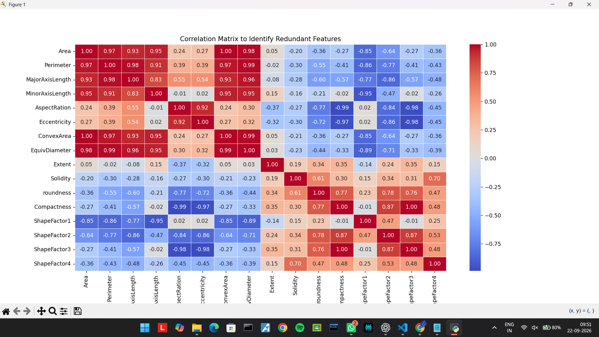

# 🫘 Dry Bean Classification using Machine Learning

An end-to-end multiclass machine learning project for classifying dry bean varieties based on morphological measurements.

The project covers **Exploratory Data Analysis, feature selection, model comparison, hyperparameter optimization, evaluation, and deployment** using Streamlit.

## 🚀 Live Demo

**Streamlit App:**
[https://dry-bean-classification-6zcd7yzo7mipuxvdgtsjf4.streamlit.app/]

## 📌 Problem Statement

The objective of this project is to classify dry beans into one of seven varieties using morphological characteristics extracted from bean images.

The model predicts the following bean classes:

* BARBUNYA
* BOMBAY
* CALI
* DERMASON
* HOROZ
* SEKER
* SIRA

---

## 📊 Dataset

The project uses the **Dry Bean Dataset** containing:

* **13,611 samples**
* **16 original morphological features**
* **7 bean classes**

The features describe different geometric and morphological properties of the beans, including area, axis lengths, compactness, roundness, and shape factors.

---

## 🔎 Exploratory Data Analysis

Exploratory Data Analysis was performed before model training to understand the dataset and identify potentially redundant features.

The analysis included:

### Univariate Analysis

* Feature distributions
* Distribution shape
* Normality assessment
* Outlier inspection

Detailed univariate analysis plots are available in:

```text
EDA_Results/Univariate_Analysis/
```

### Bivariate Analysis

Feature relationships were analyzed against the target bean classes using class-wise visualizations.

Detailed bivariate analysis plots are available in:

```text
EDA_Results/Bivariate_Analysis/
```

### Correlation Analysis

A correlation heatmap was used to identify relationships between numerical features.



---

## 🧹 Feature Selection

Based on the EDA and feature relationships, the following five features were removed:

```text
Perimeter
EquivDiameter
ConvexArea
Eccentricity
ShapeFactor3
```

The final model was trained using **11 features**:

```text
Area
MajorAxisLength
MinorAxisLength
AspectRation
Extent
Solidity
roundness
Compactness
ShapeFactor1
ShapeFactor2
ShapeFactor4
```

---

## 🤖 Model Comparison

Multiple classification algorithms were evaluated:

* Logistic Regression
* Decision Tree
* Random Forest
* Support Vector Machine
* Naive Bayes
* K-Nearest Neighbors
* XGBoost

Classification reports and confusion matrices were used to evaluate model performance.

Based on the observed classification performance, **XGBoost** was selected for further hyperparameter optimization.

---

## ⚙️ Hyperparameter Optimization

The selected XGBoost model was optimized using **RandomizedSearchCV**.

### Configuration

* **Cross-validation:** 5-fold Stratified Cross-Validation
* **Random combinations:** 20
* **Total model fits:** 100
* **Optimization metric:** Macro F1-score

Macro F1-score was used because this is a multiclass classification problem and it provides a balanced view of performance across the different bean classes.

### Best Parameters

```text
n_estimators       = 200
learning_rate      = 0.1
max_depth          = 8
min_child_weight   = 1
subsample          = 0.9
colsample_bytree   = 0.8
```

The best cross-validation Macro F1-score was approximately **94.29%**.

---

## 📈 Final Model Performance

The tuned XGBoost model was evaluated on a held-out test set.

| Metric          |  Score |
| --------------- | -----: |
| Accuracy        | 92.32% |
| Macro Precision | 93.77% |
| Macro Recall    | 93.39% |
| Macro F1-score  | 93.57% |

### Classification Report

| Bean Class | Precision | Recall | F1-score |
| ---------- | --------: | -----: | -------: |
| BARBUNYA   |      0.94 |   0.90 |     0.92 |
| BOMBAY     |      1.00 |   1.00 |     1.00 |
| CALI       |      0.94 |   0.94 |     0.94 |
| DERMASON   |      0.91 |   0.92 |     0.91 |
| HOROZ      |      0.96 |   0.96 |     0.96 |
| SEKER      |      0.95 |   0.95 |     0.95 |
| SIRA       |      0.86 |   0.86 |     0.86 |

---

## 📊 Confusion Matrix

The confusion matrix was used to analyze class-level prediction errors and identify which bean varieties were more frequently confused with each other.

**Add your confusion matrix image here:**

```text

```

---

## 🌟 Feature Importance

The final XGBoost model's feature importance showed the following top features:

| Feature         | Importance |
| --------------- | ---------: |
| Compactness     |     26.12% |
| Area            |     21.13% |
| ShapeFactor1    |     15.78% |
| MajorAxisLength |      8.12% |
| AspectRation    |      7.68% |

The three most important features together account for approximately **53% of the model's feature importance**.

Feature importance represents how the model uses the features for prediction and should not be interpreted as causal importance.

---

## 🌐 Deployment

The trained XGBoost model was saved using `joblib` and deployed using **Streamlit**.

The deployed application allows users to enter the 11 morphological measurements and receive:

* Predicted bean class
* Prediction probability
* Probability distribution across all seven classes

### Application Workflow

```text
User Input
     ↓
Streamlit Interface
     ↓
11 Morphological Features
     ↓
Saved XGBoost Model
     ↓
Prediction
     ↓
Bean Class + Prediction Probabilities
```

---

## 📁 Project Structure

```text
dry-bean-classification/
│
├── EDA_DRY_BEAN.py
│
├── EDA_Results/
│   ├── Univariate_Analysis/
│   └── Bivariate_Analysis/
│
├── beans_classfication.py
├── app.py
│
├── Dry_Bean_Dataset.xlsx
│
├── dry_bean_xgboost.pkl
├── label_encoder.pkl
│
├── XGBoost_Feature_Importance.xlsx
├── XGBoost_Tuning_Results.xlsx
├── bi_analysis_report.txt
├── correlation_heatmap.png
│
├── requirements.txt
└── .gitignore
```

---

## 🛠️ Technologies Used

* Python
* Pandas
* NumPy
* Scikit-learn
* XGBoost
* Matplotlib
* Seaborn
* Data Profiling
* Joblib
* Streamlit
* OpenPyXL

---

## ▶️ Run Locally

Clone the repository:

```bash
git clone https://github.com/ayandabhoya07/dry-bean-classification.git
```

Navigate to the project directory:

```bash
cd dry-bean-classification
```

Install the required dependencies:

```bash
pip install -r requirements.txt
```

Run the Streamlit application:

```bash
streamlit run app.py
```

---

## 💡 Key Learnings

Through this project, I practiced:

* Exploratory Data Analysis
* Feature selection
* Multiclass classification
* Model comparison
* Stratified cross-validation
* Hyperparameter optimization
* XGBoost
* Confusion matrix analysis
* Feature importance
* Model serialization
* Deployment of machine learning models using Streamlit

---

## 🔮 Future Improvements

Potential future improvements include:

* SHAP-based model explainability
* Probability calibration
* Additional feature engineering
* Further ensemble experimentation
* Image-based dry bean classification
* Improved Streamlit UI/UX

---

## 👤 Author

**Ayan Dabhoya**

GitHub:
https://github.com/ayandabhoya07
